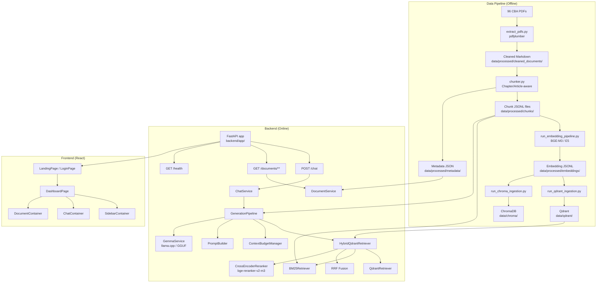
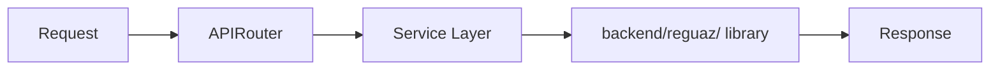
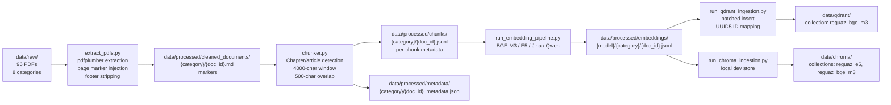
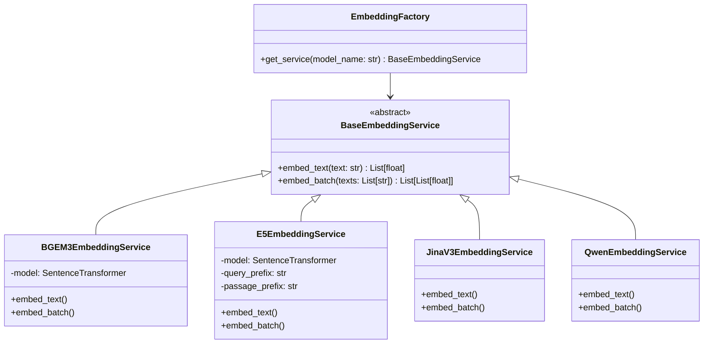
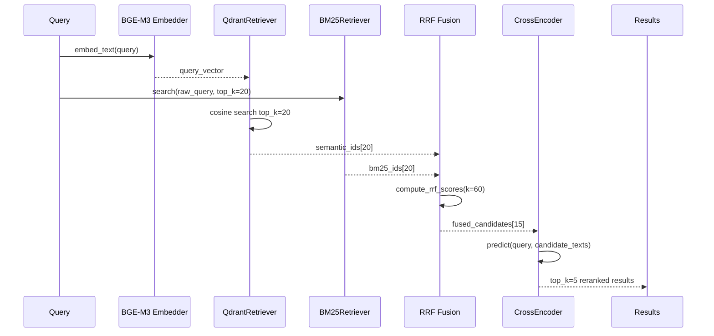
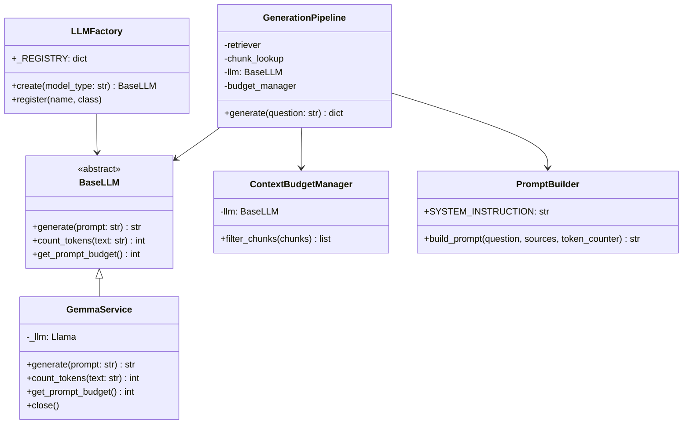
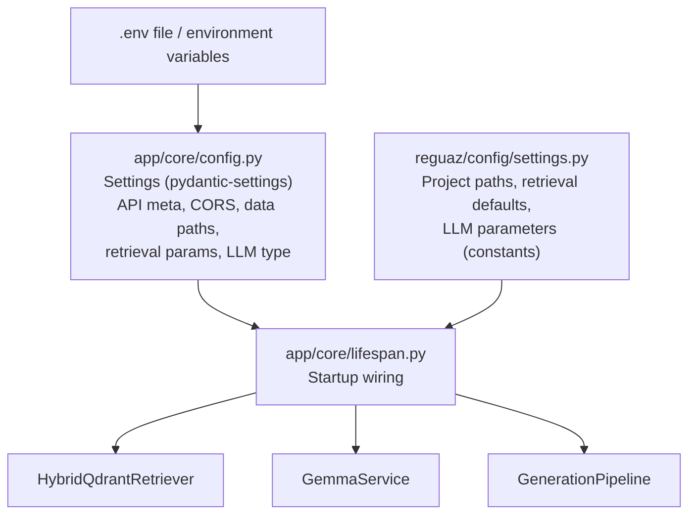
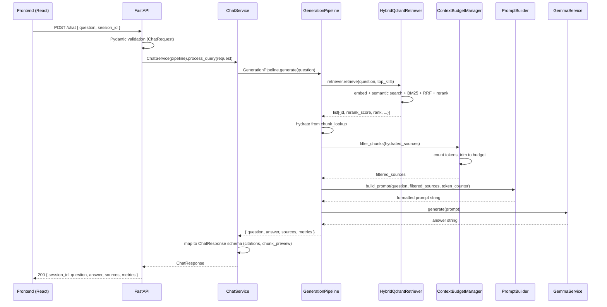

# Architecture — ReguAZ

> AI-powered regulatory intelligence platform for Azerbaijani banking compliance.

---

## Table of Contents

1. [High-Level Overview](#1-high-level-overview)
2. [Component Map](#2-component-map)
3. [Backend Architecture](#3-backend-architecture)
4. [Frontend Architecture](#4-frontend-architecture)
5. [Data Pipeline](#5-data-pipeline)
6. [Embedding Pipeline](#6-embedding-pipeline)
7. [Retrieval Pipeline](#7-retrieval-pipeline)
8. [LLM Generation Layer](#8-llm-generation-layer)
9. [Evaluation Pipeline](#9-evaluation-pipeline)
10. [Configuration Flow](#10-configuration-flow)
11. [Request Lifecycle](#11-request-lifecycle)
12. [Deployment Architecture](#12-deployment-architecture)

---

## 1. High-Level Overview

ReguAZ is organized as a **layered, file-stage pipeline** on top of a FastAPI + React application shell. Each processing stage reads its inputs from disk (JSONL / JSON / Markdown) and writes its outputs back to disk, which makes every stage independently re-runnable and testable without re-executing upstream stages.

```
Raw PDFs → Extraction → Chunking → Embedding → Vector Storage
                                                      │
                                               ┌──────┴──────┐
                                          Dense (Qdrant)   Sparse (BM25)
                                               └──────┬──────┘
                                                 RRF Fusion
                                                      │
                                            Cross-Encoder Reranking
                                                      │
                                            Context Budget Management
                                                      │
                                             Prompt Construction
                                                      │
                                            Local LLM (Gemma 3 4B)
                                                      │
                                            Grounded Answer + Citations
```

The system is logically split into two layers:

| Layer | Location | Purpose |
|---|---|---|
| **Core library** | `backend/reguaz/` | Stateless retrieval, embedding, and generation logic |
| **API application** | `backend/app/` | FastAPI HTTP interface, dependency injection, lifespan management |
| **Frontend** | `frontend/` | React SPA consuming the REST API |
| **Scripts** | `scripts/` | CLI entry points for each offline pipeline stage |

---

## 2. Component Map



---

## 3. Backend Architecture

### Application Factory (`backend/app/`)

The application is built with an **application factory pattern** via `create_app()` in `app/main.py`. The factory:

1. Reads settings via `get_settings()` (cached `pydantic-settings` singleton).
2. Attaches `CORSMiddleware` with configurable origins.
3. Mounts three routers: `chat`, `documents`, `health`.
4. Registers global exception handlers that map Python exceptions to consistent `{ "success": false, "error": { "code": ..., "message": ... } }` JSON payloads.

### Lifespan Management (`app/core/lifespan.py`)

All heavy singletons are initialized **once at startup** inside a `@asynccontextmanager` lifespan function. The startup sequence executes five sequential steps:

| Step | Component | Description |
|---|---|---|
| 1 | `ChunkReader.build_lookup()` | Builds `dict[chunk_id → metadata]` from all JSONL files in `data/processed/chunks/`. |
| 2 | `DocumentService` | Scans `data/processed/metadata/` for `*_metadata.json` files and builds a document catalog. |
| 3 | `HybridQdrantRetriever` | Loads BGE-M3 embedder, opens Qdrant collection, builds BM25 corpus, loads CrossEncoder reranker. |
| 4 | `LLMFactory.create()` | Instantiates `GemmaService` via llama.cpp using the local GGUF model at the configured path. |
| 5 | `GenerationPipeline` | Wires retriever + chunk\_lookup + LLM into the single orchestrator called by every `/chat` request. |

All components are stored in `AppState`, which is attached to `app.state.reguaz`. Route handlers access them exclusively through dependency functions in `app/core/dependencies.py`.

### Routers and Services



| Router | Service | Responsibility |
|---|---|---|
| `POST /chat` | `ChatService` | Delegates to `GenerationPipeline.generate()`, maps output to `ChatResponse` with citation indices and session-based conversation history. |
| `GET /documents` | `DocumentService` | Returns all indexed document metadata cards. |
| `GET /documents/{id}` | `DocumentService` | Returns metadata + related articles for a single document. |
| `GET /documents/{id}/page/{n}` | `DocumentService` | Extracts page text from the cleaned Markdown file using `<!-- PAGE: N -->` boundary markers. |
| `GET /documents/highlight` | `DocumentService` | Resolves chunk coordinates (page, article, text) for source highlighting in the UI. |
| `GET /health` | — | Reports readiness of all five startup components. |
| `GET /` | — | Fast ping returning `{ name, version, status: "online" }`. |

### Dependency Injection

Dependencies are constructor-injected from `AppState` via `Depends()`. Route handlers never construct models or services themselves. This ensures:
- Singleton models are loaded once.
- Tests can override the DI layer without touching route handlers.
- Startup failures surface immediately (via `raise`) before the server accepts traffic.

---

## 4. Frontend Architecture

The frontend is a **React 19 + Vite + TypeScript** single-page application using **TailwindCSS** for styling.

### Tech Stack

| Concern | Library |
|---|---|
| Framework | React 19, TypeScript |
| Build | Vite 6 |
| Routing | React Router v7 |
| State | Zustand v5 (UI state, active conversation state), TanStack Query v5 (server state) |
| UI Components | Radix UI primitives + shadcn/ui pattern |
| Animations | Framer Motion |
| Markdown rendering | react-markdown + remark-gfm |
| Notifications | Sonner |

### Page Structure

```
/               → LandingPage       (public)
/login          → LoginPage         (public)
/register       → RegisterPage      (public)
/dashboard      → DashboardPage     (protected via AuthProvider)
*               → redirect to /
```

### Dashboard Layout

`DashboardPage` implements a **three-column layout** with responsive breakpoints:

```
┌─────────────────────────────────────────────────────────┐
│  SidebarContainer   │  ChatContainer    │ DocumentContainer│
│  (conversation      │  (main Q&A        │  (side-by-side   │
│   history + nav)    │   interface)      │   document view) │
│                     │                   │                  │
│  On mobile:         │                   │  On mobile:      │
│  Sheet drawer (left)│                   │  Sheet drawer    │
│                     │                   │  (right)         │
└─────────────────────────────────────────────────────────┘
```

### API Client (`frontend/src/services/api.ts`)

A single `apiService` object wraps all backend calls. It supports a **mock API toggle** (`VITE_USE_MOCK_API` env variable or `reguaz-use-mock-api` localStorage key) that switches between the real FastAPI backend and `mockService.ts` for offline development.

The API client targets the base URL from `VITE_API_URL` (default: `http://localhost:8000`).

---

## 5. Data Pipeline

The offline data pipeline converts raw PDFs into indexed vector stores through five sequential stages, each driven by a CLI script in `scripts/`.



### Document Categories

The 96 source PDFs span eight regulatory categories:

| Category slug | Description |
|---|---|
| `laws` | Primary legislation |
| `aml_kyc` | Anti-money laundering and Know Your Customer requirements |
| `governance_and_compliance` | Corporate governance and compliance frameworks |
| `guidance_and_methodology` | Methodological guidance documents |
| `payments_and_banking_operations` | Payment system and banking operations rules |
| `prudential_regulations` | Prudential and capital adequacy standards |
| `reporting_and_audit` | Reporting formats and audit instructions |
| `risk_management` | Risk management frameworks |

### Chunking Strategy

The chunker (`scripts/chunker.py`) uses regex patterns to detect chapter and article boundaries in Azerbaijani regulatory text:
- **Chapter pattern**: Detects `Fəsil` / `Bölmə` headings with Roman or Arabic numerals.
- **Article pattern**: Detects `Maddə N` or `N.` article markers.

Each logical chapter/article section is accumulated and then split using:
- **Window size**: 4,000 characters
- **Overlap**: 500 characters

Chunk IDs use a human-readable scheme: `{document_id}_{ch_N_art_M}_{index}`, enabling stable cross-run ID matching.

Each chunk JSONL record contains: `chunk_id`, `document_id`, `title`, `category`, `chapter`, `article`, `section`, `subsection`, `page_start`, `page_end`, `source_file`, `text`.

---

## 6. Embedding Pipeline

The embedding layer follows a **factory + strategy pattern** with a common `BaseEmbeddingService` interface.



| Model | HuggingFace ID | Status | Notes |
|---|---|---|---|
| `bge_m3` | `BAAI/bge-m3` | **Production** | No asymmetric prefix required. 1024-dim. |
| `e5` | `intfloat/multilingual-e5-large` | Evaluated | Asymmetric: `query: ` / `passage: ` prefixes. |
| `jina_v3` | `jinaai/jina-embeddings-v3` | Implemented | Unified interface. |
| `qwen` | `Qwen/Qwen3-Embedding-0.6B` | Implemented | Unified interface. |

Embeddings are persisted to `data/processed/embeddings/{model}/{category}/{doc_id}.jsonl` via `EmbeddingWriter` and read back by `EmbeddingReader`.

---

## 7. Retrieval Pipeline

### HybridQdrantRetriever

The production retriever (`backend/reguaz/retrieval/hybrid_qdrant.py`) orchestrates four sub-components:



**Step-by-step:**

1. **Embed query** — `BGE-M3` generates a 1024-dim query vector.
2. **Semantic search** — `QdrantRetriever` fetches `top_k_semantic=20` results from the `reguaz_bge_m3` Qdrant collection using cosine similarity.
3. **BM25 search** — `BM25Retriever` (built over all chunk texts at startup) returns `top_k_bm25=20` results using `BM25Okapi` with a whitespace tokenizer.
4. **RRF Fusion** — `compute_rrf_scores` merges the two ranked lists using `score = 1 / (k + rank)` with `k=60`.
5. **Candidate selection** — Top `rerank_top_k=15` fused candidates are passed to the reranker.
6. **Cross-Encoder reranking** — `BAAI/bge-reranker-v2-m3` scores each `(query, chunk_text)` pair directly. `max_length=1024`.
7. **Sort and trim** — Results are sorted descending by rerank score; top `final_top_k=5` are returned.

Each result dict contains: `id`, `rerank_score`, `rank`, `rrf_score`, `semantic_rank`, `bm25_rank`.

### Retriever Defaults (API-configured)

| Parameter | Default | Env override |
|---|---|---|
| `TOP_K_SEMANTIC` | 20 | `TOP_K_SEMANTIC` |
| `TOP_K_BM25` | 20 | `TOP_K_BM25` |
| `RERANK_TOP_K` | 15 | `RERANK_TOP_K` |
| `DEFAULT_TOP_K` | 5 | `DEFAULT_TOP_K` |
| `RRF_K` | 60 | `RRF_K` |
| Embedding model | `bge_m3` | `EMBEDDING_MODEL` |
| Reranker model | `BAAI/bge-reranker-v2-m3` | `RERANKER_MODEL` |

### BM25 Corpus

The BM25 index is built in-memory at startup from all chunk texts loaded from `data/processed/chunks/`. It uses a whitespace tokenizer, which is appropriate for mixed Azerbaijani/Russian/English regulatory text. The corpus is **not persisted** — it is rebuilt from disk each time the server starts.

---

## 8. LLM Generation Layer

### Component Hierarchy



### GemmaService

- **Model**: Gemma 3 4B Instruct — GGUF format (`gemma-4-E4B-it-Q4_K_M.gguf`), quantized Q4_K_M.
- **Backend**: `llama-cpp-python` with `n_gpu_layers=-1` (full GPU offload on Apple Silicon via Metal; CUDA on NVIDIA).
- **Context window**: 8,192 tokens.
- **Max generation tokens**: 512.
- **Sampling**: `temperature=0.1`, `top_p=0.95`, `top_k=40`, `repeat_penalty=1.1`, `seed=42`.

### Context Budget Management

`ContextBudgetManager.filter_chunks()` uses the LLM's `count_tokens()` (via the llama.cpp tokenizer) to ensure the assembled context fits within the available token budget:

```
budget = context_window - max_tokens - PROMPT_RESERVED_TOKENS
       = 8192 - 512 - 300
       = 7380 tokens
```

Chunks are included in ranked order until the budget is exhausted. This prevents context overflow at generation time.

### Prompt Design

`PromptBuilder` constructs a structured prompt with:
- A **system instruction** in English, enforcing Azerbaijani output, strict context-only answers, and numeric inline citation markers `[1]`, `[2]`, etc.
- **Numbered context blocks** for each retrieved chunk (document title, category, chapter, article, section, page range, and text).
- The **user question** followed by `Answer:`.

The LLM is explicitly instructed to:
- Answer only from provided context.
- Use `[N]` citation markers that align with the `sources` array in the API response.
- Respond in Azerbaijani.
- State that information is not available if it cannot be found in context.

---

## 9. Evaluation Pipeline

The evaluation system spans two sub-pipelines:

### Retrieval Evaluation

Scripts in `scripts/` drive evaluation against a **121-question hand-labeled gold dataset** (`data/evaluation/gold_dataset_for_embedding_excel.xlsx`).

Three evaluation scripts cover different retrieval configurations:

| Script | Retrieval Mode | Vector Store |
|---|---|---|
| `run_retrieval_evaluation.py` | Dense only (E5, BGE-M3) | ChromaDB |
| `run_hybrid_evaluation.py` | Dense + BM25 + RRF (E5, BGE-M3) | ChromaDB |
| `run_hybrid_qdrant_evaluation.py` | Dense + BM25 + RRF + Cross-Encoder | Qdrant |

Each script writes `metrics.json`, `per_question.csv`, `retrieval_results.csv`, and appends to a cross-run `comparison.csv` under `results/`.

### Generation Evaluation

`GenerationEvaluator` runs the full `GenerationPipeline` over a separate gold dataset (`data/evaluation/gold_dataset_for_llm_generation.xlsx`) and saves generated answers with timing metrics.

`ContextEnricher` (offline script) enriches saved answers with the retrieved context chunks.

`RagasEvaluator` computes LLM-as-a-judge metrics using:
- **Judge LLM**: `meta/llama-3.3-70b-instruct` via NVIDIA NIM API.
- **Embedding model** (for `AnswerRelevancy`): `intfloat/multilingual-e5-large` (local).
- **Metrics**: `Faithfulness`, `AnswerRelevancy`, `ContextRecall`.

---

## 10. Configuration Flow



Two configuration layers exist:

| Module | Type | Scope |
|---|---|---|
| `backend/reguaz/config/settings.py` | Constants (`.py` module) | Paths, retrieval defaults, LLM hyperparameters. Environment variables can override paths. |
| `backend/app/core/config.py` | `pydantic-settings` | Full API configuration read from `.env` or environment. Singleton via `lru_cache`. |

**Environment variables** (`backend/app/core/config.py` keys):

| Variable | Default | Purpose |
|---|---|---|
| `APP_ENV` | `development` | Environment label |
| `DEBUG` | `false` | FastAPI debug mode |
| `CORS_ORIGINS` | `localhost:5173,3000` | Allowed browser origins |
| `QDRANT_DIR` | `data/qdrant` | Relative path to Qdrant storage |
| `CHUNKS_DIR` | `data/processed/chunks` | Chunk JSONL root |
| `METADATA_DIR` | `data/processed/metadata` | Document metadata root |
| `EMBEDDING_MODEL` | `bge_m3` | Embedding model identifier |
| `RERANKER_MODEL` | `BAAI/bge-reranker-v2-m3` | CrossEncoder model |
| `TOP_K_SEMANTIC` | `20` | Qdrant candidate count |
| `TOP_K_BM25` | `20` | BM25 candidate count |
| `RERANK_TOP_K` | `15` | Post-RRF reranker candidate count |
| `DEFAULT_TOP_K` | `5` | Final results returned per query |
| `RRF_K` | `60` | RRF smoothing constant |
| `LLM_TYPE` | `gemma` | LLM factory key |
| `HF_TOKEN` | — | HuggingFace token for model downloads |
| `NVIDIA_API_KEY` | — | NVIDIA NIM API key (RAGAS evaluation only) |

---

## 11. Request Lifecycle



**Typical timings** (hardware-dependent):
- Retrieval (embed + Qdrant + BM25 + RRF + rerank): ~2–8 s
- Prompt build: <0.1 s
- LLM generation (Gemma 3 4B Q4_K_M, 512 tokens): ~5–20 s on Apple Silicon

---

## 12. Deployment Architecture

### Current Deployment Model (Local/On-Premise)

ReguAZ runs fully offline and is designed for B2B local or on-premise infrastructure to ensure absolute compliance and data residency:

- **Local Backend**: The FastAPI backend app runs locally under Uvicorn.
- **Local LLM**: Llama.cpp runs locally using GGUF weights, utilizing local accelerators (CPU/CUDA/MPS) natively.
- **Local Databases**: Qdrant runs as a local database directory. ChromaDB runs locally in memory or is persisted to the local directory.
- **On-Premise Hosting**: The target architecture is containerized inside local/on-premise servers.

```
┌──────────────────────────────────────────────────────────────┐
│  On-Premise / Local Server Node                              │
│                                                              │
│  ┌────────────────────┐          ┌────────────────────────┐  │
│  │  Vite/Nginx Server │          │  Uvicorn (FastAPI)     │  │
│  │  (React Fronted)   │─────────▶│  (Backend App)         │  │
│  └────────────────────┘          └───────────┬────────────┘  │
│                                              │               │
│                                  ┌───────────▼────────────┐  │
│                                  │  Llama.cpp Backend     │  │
│                                  │  (Gemma 3 4B Local)    │  │
│                                  └───────────┬────────────┘  │
│                                              │               │
│                                  ┌───────────▼────────────┐  │
│                                  │  Local Vector DB       │  │
│                                  │  (Qdrant Directory)    │  │
│                                  └────────────────────────┘  │
└──────────────────────────────────────────────────────────────┘
```

### Docker Containerization

The platform is fully containerized using **Docker** and **Docker Compose** for local and on-premise orchestration:
- **Backend Service**: Configured to build from a `Dockerfile`, running FastAPI under Uvicorn.
- **Qdrant Service**: Formatted to run the official Qdrant image, mapping `data/qdrant` as a persistent volume.
- **Local Deployment Command**: Start the unified local stack using:
  ```bash
  docker compose up --build
  ```
- **Volume Mounts**: Models (`backend/reguaz/models/`), raw documents, and processed chunks/indices are mapped via local persistent mounts so that data does not leave the host machine.
- **Hardware Acceleration**: The Docker environment is configured to mount host device layers (e.g., CUDA or standard CPU bounds) to allow acceleration during containerized local LLM generation.
